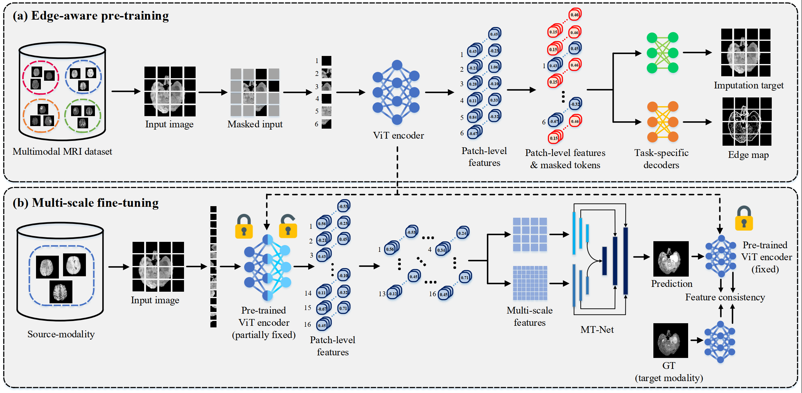
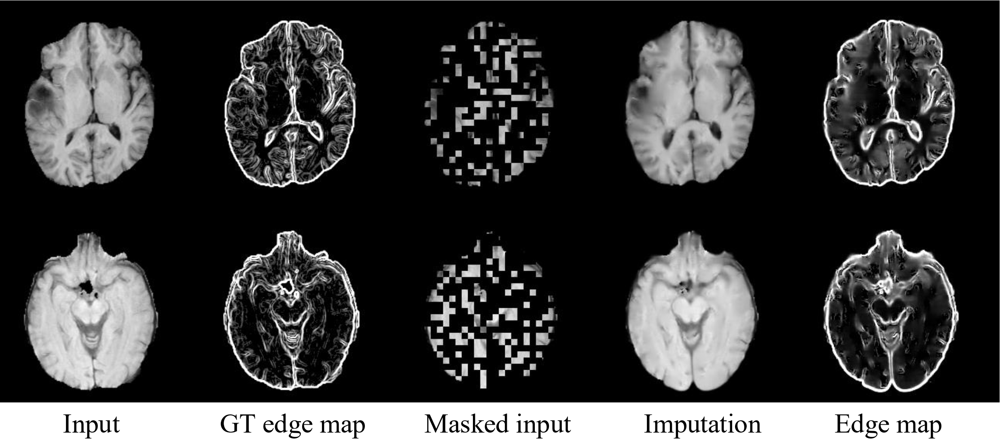

# MT-Net
We provide Pytorch implementations for our paper "Multi-scale Transformer Network for Cross-Modality MR Image Synthesis"
  
## 1. Introduction

We propose MT-Net to leverage to take advantage of both paired and unpaired data in MRI synthesis. 

<p align="center">
     <br />
    <em> 
    Figure 2. An overview of the proposed MT-Net.
    </em>
</p>

**Preview:**

Our proposed methods consist of two main components under two different settings: 

- Edge-MAE (Self-supervised pre-training with image imputation and edge map estimation).

- MT-Net (Cross-modality MR image synthesis)

Note that our pre-trained Edge-MAE can be utilized for various downstream tasks, such as segmentation or classification.

<p align="center">
     <br />
    <em> 
    Figure 2. Example of imputed image and estimated edge maps from the BraTS2020 dataset.
    </em>
</p>

## 2. Getting Started

- ### Installation

  Install PyTorch and torchvision from http://pytorch.org and other dependencies. You can install all the dependencies by
  ```bash
  pip install -r requirements.txt
  ```
  
- ### Dataset Preparation

  Download [BraTS2020](https://www.med.upenn.edu/cbica/brats2020/data.html) dataset. The file name should be `./data/MICCAI_BraTS2020_TrainingData.zip`.

- ### Date Preprocessing

  After preparing all the data, run the `./utils/preprocessing.py` to normalize the data to [0,1] and crop out an image of size 200×200 from the center.

- ### Pre-training

  To pre-train our Edge-MAE, run `pretrain.py`. You may change the default settings in the `./options/pretrain_options.py`. The weights will be saved in `./weight/EdgeMAE/`. You can also use the pre-trained checkpoints of Edge-MAE in the `./weight/EdgeMAE/`.

- ### Fine-tuning

   To fine-tune our MT-Uet, run `Finetune.py`. You may change the default settings in the `./options/finetune_options.py`, especially the `data_rate` option to adjust the amount of paired data for fine-tuning. The weights will be saved in `./weight/finetuned/`. Note that for MT-Net, the input size must be 256×256.

- ### Test

  When fine-tuning is completed, the weights of Edge-MAE and MT-Net will be saved in `./weight/finetune/`. You can change the default settings in the `./options/test_options.py`. Then, run `test.py`, and the synthesized image will be saved in `./snapshot/test/`, and can obtain the PSNR, SSIM, and NMSE values.

## 3. Citation

```bibtex
@misc{li2022MT-Net,
      title={Multi-scale Transformer Network for Cross-Modality MR Image Synthesis}, 
      author={Yonghao Li and Tao Zhou},
      year={2023},
}
```

## 4. References
- BraTs 2020: [[HERE]](https://www.med.upenn.edu/cbica/brats2020/data.html)

- MAE: [[HERE]](https://github.com/facebookresearch/mae)

- SwinUNet: [[HERE]](https://github.com/HuCaoFighting/Swin-Unet)
